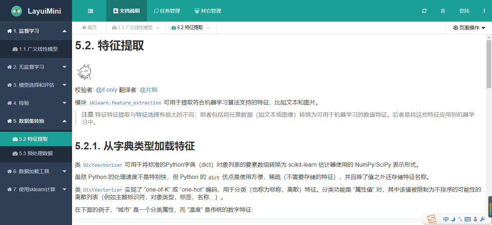
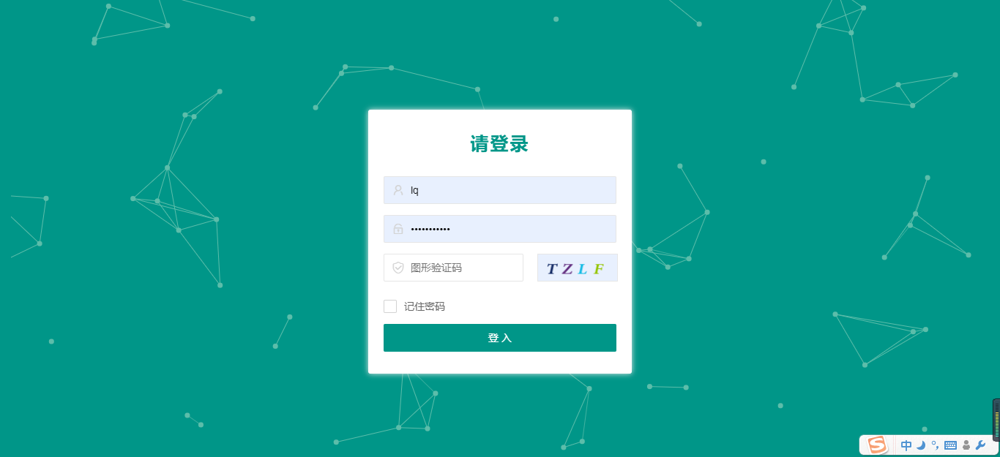
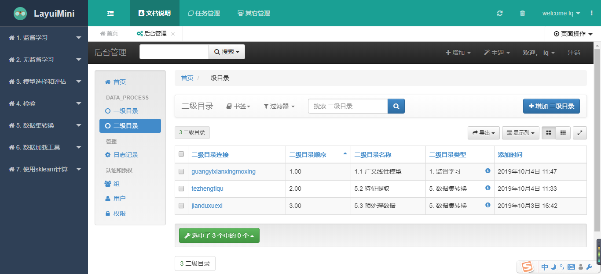
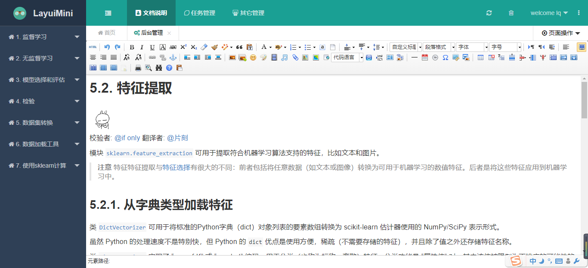

# 基于django和layui搭建的知识管理web，可以团队使用，也可以作为个人博客搭建，使用简单，高效，快捷

后台数据库暂时使用sqlite3

## 主页

## 登陆界面
登陆界面可以使用图片验证码，登陆之后可以进行文档的增，改，删

## 后台管理界面
基于xadmin的后台管理

## 文档编辑界面
文档编辑使用了ueditor的富文本编辑，可以简单方便的对文档进行编辑

